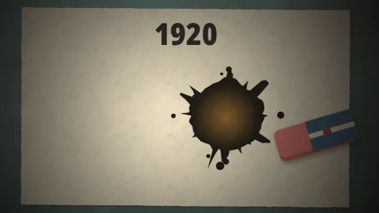
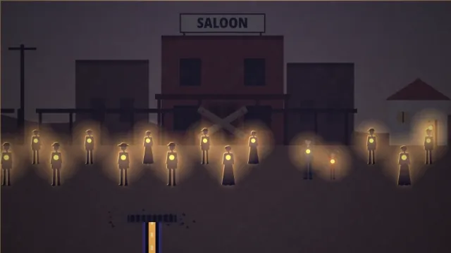
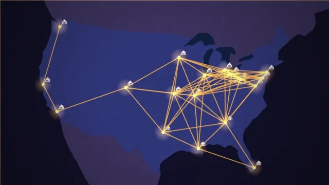

# Nomolos 01 · Prohibition: the animation

  
  
  
  

<h3 align="center"><a href="https://raisulsohan.github.io/Nomolos_01_Prohibition-animation/">▶ Watch the whole film (9:40) in your browser</a></h3>

Click a clip to open its scene.

  <strong>An animated documentary film created, written, directed, and animated by <a href="https://raisulsohan.com">Raisul Sohan</a></strong>

The animation of *Prohibition*, the first Nomolos documentary, conceived, written, and animated by **[Raisul Sohan](https://raisulsohan.com)**. Every frame is mathematically composed and drawn in JavaScript on an HTML5 canvas using his own procedural drawing code, and the film itself uses zero video or image files. The clips above are recordings of the pages. Each frame is a pure function of time, so any moment can be drawn on its own.

The pages play silently.

## Watch

**Online: https://raisulsohan.github.io/Nomolos_01_Prohibition-animation/**. Play the whole film or any scene, in 16:9 or
4:5.

Offline, open `index.html` or any page in a browser. No build step and no server are needed.

- `preview/` holds the whole film (`…_film_Desktop.html`, `…_film_Mobile.html`, 9:40) and the film scene by scene:
  `…_scene-NN_Desktop.html` (16:9, 1920×1080) and `…_scene-NN_Mobile.html` (4:5, 1080×1350).
- `sequences/seq-NN/` holds the single sequences each scene is made of: `film.html` (16:9) and `film-4x5.html` (4:5).

Player keys: <kbd>Space</kbd> play/pause, <kbd>←</kbd>/<kbd>→</kbd> one frame, <kbd>Shift</kbd>+<kbd>←</kbd>/<kbd>→</kbd>
one second, <kbd>Home</kbd> back to the start, <kbd>F</kbd> fullscreen. Add `?t=12.5` to a page's URL to freeze one frame.

## Layout

| Path | What it is |
|---|---|
| `lib/` | the engine: the film clock, the player and the shared drawing code |
| `sequences/seq-NN/film.js` | the drawing code of one sequence, in both formats |
| `sequences/seq-NN/timing.js` | the sequence's length and the start and end of each of its shots |
| `fonts/` | Noto Sans SemiBold and Noto Sans Condensed Black |

## Author & Credits

- **Creator, Animator & Director:** [Raisul Sohan](https://raisulsohan.com) ([@raisulsohan](https://github.com/raisulsohan))
- **Production:** Nomolos Documentaries (Episode 01)
- **Animation & Engine:** Handcrafted by Raisul Sohan using procedural vector mathematics and HTML5 Canvas 2D drawing code.

## License

The fonts are Noto Sans, © The Noto Project Authors, under the SIL Open Font License 1.1 (`fonts/OFL.txt`).
